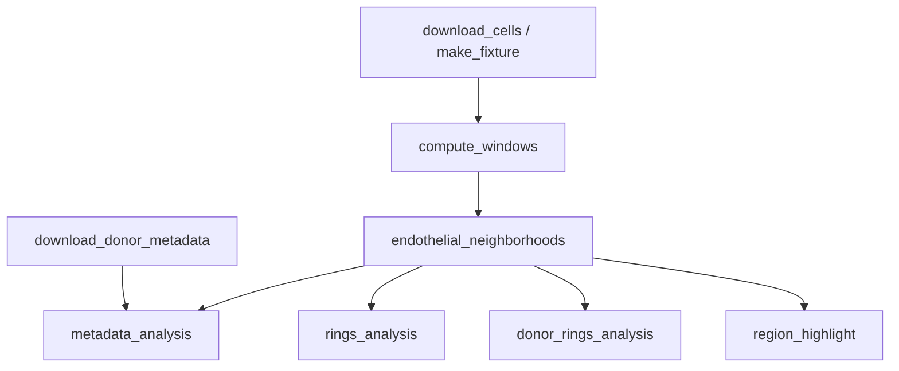

# Vasculature neighbourhoods

Endothelial cell-centric neighbourhood analysis of the HuBMAP human intestine
CODEX dataset, from Hickey et al. (2023), "Organization of the human
intestine at single-cell resolution", Nature 619:572-584
(<https://doi.org/10.1038/s41586-023-05915-x>). Credit for the underlying
data, cell-type and metadata annotation, and the original analysis design
goes to the Hickey Lab; this fork ports two exploratory notebooks into a
reproducible Snakemake workflow. Upstream:
<https://github.com/HickeyLab/Vasculature_neighborhoods>.

For each region of tissue, a k-nearest-neighbour composition window is built
around every cell. Windows centred on endothelial cells are clustered
(MiniBatchKMeans) into named neighbourhoods (e.g. "Endothelial Rich",
"Immune Enriched"), which are then examined at increasing window radii
("rings") and stratified by donor and by metadata (BMI, hypertension,
tissue).

## Data

- **Single-cell table**: Dryad
  <https://doi.org/10.5061/dryad.pk0p2ngrf> (`23_09_CODEX_HuBMAP_alldata_Dryad_merged.csv`,
  ~2.9 GB, CC0). One row per segmented cell: position, tissue region,
  cell-type and subtype annotation, and per-marker intensities.
  `donor_metadata.csv` (same dataset) has each donor's age, sex, race, BMI
  and clinical history.
- Both files download automatically (`pixi run all`) into
  `/mnt/nvme/hickeylab/shared/hubmap-intestine-codex/`, shared with other
  HickeyLab-fork workflows on this machine. An exclusive `flock` around the
  download rule serialises concurrent runs so two workflows never fetch the
  same file at once. Total download is ~2.9 GB, under the 25 GB limit.
- datadryad.org sits behind an Anubis proof-of-work anti-scraper. The
  download rule solves the challenge the same way a browser's JS does (an
  open, documented protocol: find a nonce so that
  `sha256(challenge.randomData + nonce)` has the required leading zero hex
  digits, then redeem it) rather than requiring a human to click through.
- Every download is verified against a SHA-256 committed in
  `config/config.yaml`.
- If the data cannot be reached (network policy, Dryad downtime), the
  workflow still resolves against `config/smoke.yaml`, which points at a
  synthetic fixture generated by `workflow/scripts/make_fixture.py` and runs
  the identical DAG end to end.

## Running

Requires [pixi](https://pixi.sh).

```sh
pixi run smoke   # synthetic fixture, whole DAG, well under 5 minutes on CPU
pixi run all     # real data: download, verify, compute, plot
pixi run test    # pytest
pixi run lint    # ruff check + ruff format --check + pyrefly check
```

All heavy steps are CPU-only (no GPU is used or required), run under
`nice -n 19`, and are capped at 6 threads
(`snakemake --cores 6`, `OMP_NUM_THREADS=6`) to share this machine with other
concurrent workflows.

## Workflow (DAG)



- **compute_windows**: for every configured window radius `k` (`[5, 10, 30,
  50, 100, 300]` cells), the composition of each cell's `k` nearest
  neighbours within its own tissue region.
- **endothelial_neighborhoods**: clusters the `k=50` windows centred on
  endothelial cells into 20 groups (MiniBatchKMeans, seeded), merges them
  into 11 named neighbourhoods per `config.yaml`, and labels every
  endothelial cell.
- **rings_analysis**: the log-fold-change and percent composition of every
  named neighbourhood's window at every `k`, showing how composition changes
  with radius.
- **donor_rings_analysis**: the same, per donor, plus the ratio of
  endothelial percentage at `k=300` vs `k=5` and normalisation against each
  tissue subregion's (mucosa / submucosa / muscularis externa) baseline
  endothelial percentage.
- **metadata_analysis**: donor neighbourhood composition regressed against
  BMI, compared by history of hypertension (independent t-test) and by
  tissue (small bowel vs colon, paired t-test), and a Kruskal-Wallis /
  Dunn's post-hoc test across (neighbourhood, tissue) groups.
- **region_highlight**: one tissue section's cells, coloured by endothelial
  cell-centric neighbourhood.

Figures are written as matching `.png` and `.pdf` pairs under
`results/<run_name>/`; tables as `.csv`; test statistics as `.json`.

## Configuration

`config/config.yaml` lists every path, URL, checksum, seed and parameter the
original notebooks hardcoded: the window radii, the endothelial clustering
`k` and cluster count, the manual cluster-to-name annotation, the
neighbourhood-to-subregion mapping, and the metadata analysis's significance
threshold. `config/smoke.yaml` overrides the data source (pointing at a
generated fixture) and shrinks every parameter (fewer `k` values, fewer
clusters) so the whole DAG completes quickly; keys it does not set fall back
to `config.yaml`.

## Parity with upstream

The upstream notebooks' stored cell outputs (tables, printed statistics)
were extracted before deletion; see `~/planning/Vasculature_neighborhoods/parity.md`
for the full comparison table. Summary from the completed `pixi run all`
against the real data: every data-level quantity matches upstream exactly,
several to sixteen significant digits (total endothelial cell count, region
and donor counts, average endothelial nearest-neighbour distance, subregion
baseline endothelial percentages). Quantities that depend on which of the 20
raw `MiniBatchKMeans` clusters got a given name (e.g. "Paneth + Immune")
do not reproduce upstream's numbers: that manual index-to-name annotation is
tied to one specific run's arbitrary cluster-label ordering, and
`MiniBatchKMeans` does not guarantee that ordering is stable across
environments, even at the same seed. `parity.md` shows the evidence
identifying this as a cluster-identity effect: a well-separated cluster like
"Endothelial Rich" matches almost exactly, while smaller ones do not.

## Differences from upstream

- **Row-swap plot ordering replaced with an explicit order.** The donor
  rings notebook set
  `combined_300_df_copy.iloc[[1, 3]] = combined_300_df_copy.iloc[[3, 1]].values`
  to reorder two rows so the bar chart grouped both "Muscularis externa"
  neighbourhoods adjacently; the underlying data was untouched, only the
  plotted category order changed. `config.yaml`'s `rings.plot_order` now
  states that order directly and it is passed as `order=` to the plotting
  calls; no row data is mutated.
- **`cellhier` vendored, not depended on.** The upstream notebooks import
  `cellhier` (the Hickey Lab's `Hierarchical-Tissue-Unit-Annotation`) from a
  local checkout via `sys.path.append`. That fork
  (<https://github.com/alejandro-soto-franco/Hierarchical-Tissue-Unit-Annotation>,
  commit `b47c15b1409dbe8a732485b62331348ee6e6d709` at time of writing) has no
  installable package yet (no `pyproject.toml`/`setup.py`), so
  `src/vasculature_neighborhoods/windows.py` and `plotting.py` vendor cleaned
  copies of the functions actually used (the k-NN window construction copied
  into both notebooks, and `plot_john.py`'s `catplot2`), with attribution in
  each module's docstring. Swap these for a pinned git dependency on
  `cellhier` once that fork ships a package.
- **Dead code removed.** `get_adata`/`adata_to_dataframe`/`sc_heat` are
  defined in both notebooks but never called, so the port drops them.
  `stacked_bar_plot` and `percent_plot` are likewise defined but unused in
  either notebook's executed cells, so the port drops them too.
- **Missing intermediate artefact restored as a direct pipeline edge.** The
  metadata notebook reads a `cells_wecnh.pkl` that the single-cell notebook
  never writes in the version in git history (most likely removed by the
  "removed unused cells" cleanup commit). The workflow wires
  `endothelial_neighborhoods`'s labelled-cells output directly into
  `metadata_analysis`, restoring the intended data flow without a manual
  hand-off file.
- **Exploratory UMAP/Leiden clustering dropped.** Cells 48-51 of the
  single-cell notebook run `sc.pp.neighbors`/`sc.tl.umap`/`sc.tl.leiden` on
  the endothelial-cell composition table as a visual sanity check; they
  produce no stored numeric output, feed no downstream cell, and UMAP/Leiden
  results are not reproducible bit-for-bit across library versions. Not
  ported; the merged neighbourhood labels used everywhere else come from the
  seeded MiniBatchKMeans step, not from this visualisation.
- **Windowing is vectorised per region rather than per-cell-loop.** Produces
  the same k-NN composition sums; see `tests/test_windows.py` for the
  region-isolation and radius-capping behaviour this depends on.
- **Seaborn API drift fixed: boxplot transparency.** `swarm_box`'s "shade the
  box faces to 30% opacity" step iterated `ax.artists`, where seaborn's
  boxplot placed its patches before its 0.12 rewrite. Under the pinned
  seaborn 0.13 those patches live on `ax.patches`; unchanged, the loop runs
  zero iterations and silently does nothing. Fixed to read `ax.patches`
  (captured before the swarm overlay adds its own points, so only box faces
  are touched).
- **Merged-neighbourhood fold change re-clusters pooled cells, not an
  average of raw centroids.** The notebook's `fc_out1` (cells 30-32)
  computes each named neighbourhood's displayed fold change and composition
  by re-fitting `MiniBatchKMeans(n_clusters=1)` on every endothelial cell
  whose raw 20-way cluster maps to that name. An earlier draft of this port
  instead averaged the 20 raw cluster centroids grouped by name, which is
  not the same computation whenever multiple raw clusters of different
  sizes share a name. `neighborhoods.merged_neighborhood_profile` now
  matches the notebook.
- **No licence added.** Upstream publishes no `LICENSE`; this fork does not
  add one, since the code is not ours to relicense.
- **"area" is derived, not read.** Notebook 1 (cell 4) sets
  `cells['area'] = cells[reg].apply(lambda x: x.split('_', 1)[1])`: the
  table has no raw "area" column (it has `unique_region`, `region` and
  `donor`, none of which is "area"). `io.derive_area_column` splits on the
  first `_` the same way, matching the notebook exactly.
- **Named-cluster identity is not reproducible across environments.** See
  `parity.md`: the manual 20-cluster-index-to-name annotation
  (`endothelial_neighborhoods.merged_labels`) is upstream's own, kept
  verbatim, but `MiniBatchKMeans` does not guarantee the same cluster gets
  the same integer label on a rerun in a different environment. Data-level
  quantities (cell counts, positions, nearest-neighbour distances, subregion
  baselines) reproduce upstream exactly; quantities keyed by a cluster's
  *name* (donor percentages, hypertension/tissue t-tests, Kruskal-Wallis)
  do not, and no attempt was made to re-derive the mapping for this run
  (that would be a different, unrequested method, not a faithful port).

## Compute notes

CPU only, no GPU used. On the real data, `compute_windows` (building every
k-nearest-neighbour composition window across ~2.6M cells) took ~17 minutes;
every other rule combined took ~1 minute; both well under the 30-minute
per-rule limit. Three other HickeyLab-fork workflows on this machine load
the same ~2.9 GB table concurrently, so every rule that does holds
`/mnt/nvme/hickeylab/shared/.bigmem.lock` for as long as that table is in
memory (`io.bigmem_lock`), serialising the big loads across all of them
rather than risking a simultaneous multi-agent peak. Reading only the
columns this analysis uses (`io.load_cells(usecols=...)`, skipping ~47
unused per-marker intensity columns) and reading low-cardinality columns as
pandas `category` dtype keep each load's memory well under this machine's
per-agent limit.
